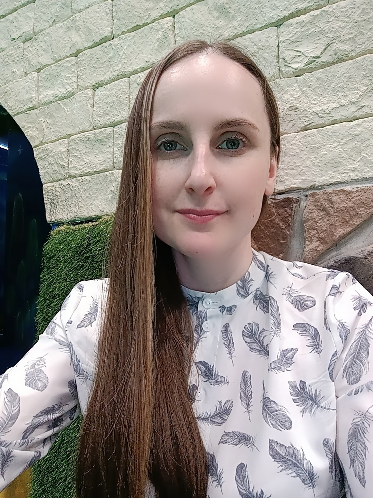

# Обо мне

**_Меня зовут Ирина, мне 31 год, живу в г. Санкт-Петербург._** 

_Работаю на производственном предприятии в отделе продаж._   

Последние несколько лет хотела научиться программировать, пару раз даже начинала самостоятельно учиться, но мои труды не увенчались успехом. Как-то раз наткнулась на статью и отзывы об обучении в Нетологии и решила записаться на курс **"Java-разработчик с нуля"** в он-лайн школу. Уже несколько месяцев я получаю знания, стараюсь уделять как можно больше времени обучению, ведь это не только возможность получения новой профессии, но и развитие меня как личности, развитие моих способностей благодаря освоению новых навыков.

_Надеюсь, что смогу проийти этот путь до конца, мне все очень нравится, и я действительно ощущаю, что это мое, мой тот долгожданный путь!_